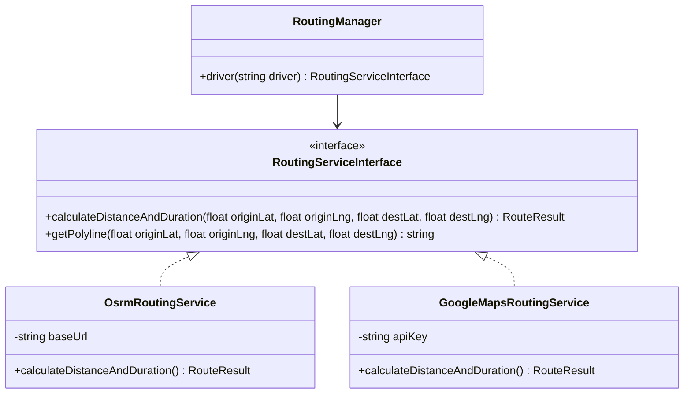
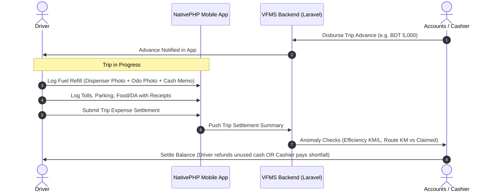
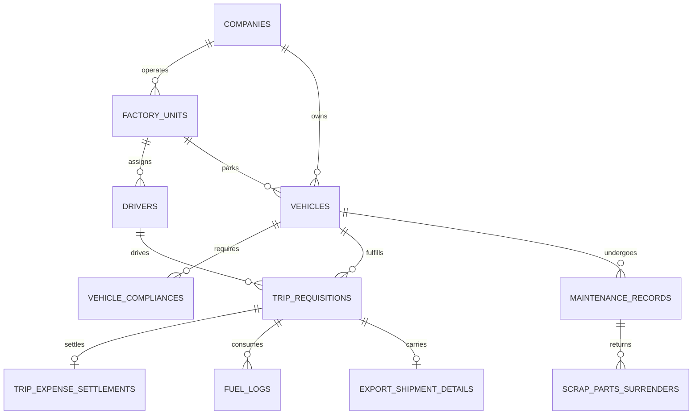

# Enterprise Vehicle & Fleet Management System (VFMS)
## Comprehensive Architecture, Domain Blueprint & Final Implementation Plan
**Tailored for Multi-Company Knit Composite & Textile Conglomerates in Bangladesh**  
**Technology Stack:** Laravel v13.x | Livewire v4.x | Filament v5.x | NativePHP Mobile v4  
**Project Path:** `C:\www\vfms`  
**Date:** September 2026 (Updated & Finalized)

---

## 1. System Overview & Context

In a multi-location knit composite textile & garments conglomerate in Bangladesh (spanning Head Office in Dhaka, mills & factories across Gazipur, Ashulia, Narayanganj, Mawna, and transit corridors to Chittagong Port and DEPZ), transportation cost is one of the top unmonitored operational expenditures.

### Key Operational Realities Incorporated:
1. **Multi-Ownership Fleet & Driver Diversity**:
   - Company-owned (100% company fueled, maintained, payroll drivers).
   - Executive Car Schemes (company pays fuel quota/maintenance ceiling, self or company driven).
   - Commercial Rented Covered Vans (Per-KM, trip-based, or monthly rental with waiting/demurrage charges).
   - Employee Personal Cars (fuel & maintenance allowance/reimbursement).
   - Ad-hoc / Auditor trips (Uber/Pathao ride claims).
2. **Cash Advance / Petty Cash / Voucher-Based Fuel & Expense Model**:
   - No corporate pump fuel credit contracts. Drivers receive cash advances prior to trips or submit vouchers/bills for post-trip reimbursement.
   - Requires full trip expense settlement: Cash Advance vs (Fuel + Toll + Parking + DA/Food + Repair) = Balance Refund or Due.
3. **Trip Bookings (Trip Requests)**:
   - Vehicle trip bookings for staff, official duties, export cartons, and ambulances are classified as **Trip Requests** (`trip_requests`).
4. **Custom ERP Verification & Maintenance Gate Pass Chain**:
   - In accordance with NAZ Bangladesh Ltd / NZ Group workflow, ERP Requisitions (`SRQ` for Service, `RQSN` for Parts), Head Office (Baridhara DOHS) SCM Purchase Orders (`PO`), and ERP Returnable Gate Passes for sending parts to external repair vendors are managed within the **Maintenance & Workshop** module, anchored by manual handwritten approvals from the Admin Head.
5. **Bilingual Support (English & Bengali / বাংলা) with Instant Toggling**:
   - Complete i18n localization across all portals and mobile views.
   - Built specifically for Bangladesh factory reality: Drivers, security gate guards, and mechanics can use the system completely in clear Bengali (বাংলা), while management and audit can toggle between English and বাংলা with a single click.
6. **Pluggable Routing Engine**:
   - Default: Open-Source Routing Engine (OSRM / OpenStreetMap) with zero recurring cost.
   - Pluggable Driver Architecture: Configurable switch to Google Maps Distance Matrix API via `.env` without modifying business logic.

---

## 1.1. Bilingual Localization Architecture (বাংলা ও ইংরেজি)

The localization engine operates at the session, user profile, and API layer:
* **Session / Cookie Switcher**: `/locale/{lang}` toggles between `en` (English) and `bn` (Bengali).
* **Role-Based Defaults**:
  - Drivers, Gate Security Guards, Store Officers $\rightarrow$ Default: **বাংলা (`bn`)**.
  - Management, Accounts, Audit, System Admins $\rightarrow$ Default: **English (`en`)** (with instant বাংলা toggle).
* **Translation Dictionaries**:
  - `lang/bn/vfms.php` and `lang/en/vfms.php` (for domain terms: Requisition, Fuel, Odometer, Gate Pass, Advance, Settlement).
  - Common RMG transport phrases in Bengali:
    - *Trip Requisition* $\rightarrow$ **ট্রিপ রিকুইজিশন / গাড়ি রিকুইজিশন**
    - *Start Trip* $\rightarrow$ **ট্রিপ শুরু করুন**
    - *Odometer Reading* $\rightarrow$ **ওডোমিটার / বর্তমান কিলোমিটার**
    - *Fuel Refill* $\rightarrow$ **জ্বালানী / গ্যাস রিফিল**
    - *Cash Advance* $\rightarrow$ **অগ্রিম নগদ টাকা (Advance Cash)**
    - *Expense Settlement* $\rightarrow$ **ভাউচার ও খরচ সমন্বয়**
    - *Gate Pass* $\rightarrow$ **গেট পাস**
    - *Scrap Part Surrender* $\rightarrow$ **পুরাতন যন্ত্রাংশ স্টোরে জমা**

---

## 2. Pluggable Routing Engine Architecture (OSRM & Google Maps)

To verify claimed trip distances without paying API fees, the system adopts Laravel's Driver / Strategy Pattern:



### Configuration (`config/vfms.php`):
```php
'routing' => [
    'default' => env('ROUTING_DRIVER', 'osrm'),
    'drivers' => [
        'osrm' => [
            'base_url' => env('OSRM_BASE_URL', 'https://router.project-osrm.org'),
        ],
        'google_maps' => [
            'api_key' => env('GOOGLE_MAPS_API_KEY'),
        ],
    ],
    'anomaly_threshold_percentage' => env('ROUTING_ANOMALY_THRESHOLD', 15.0),
],
```

---

## 3. Petty Cash, Fuel Refill & Trip Expense Settlement Workflow

Since fuel and trip costs run through cash advances and post-trip vouchers rather than corporate pump agreements:



---

## 4. Final Database Schema Blueprint (Production Specification)

Here is the finalized schema with all operational fields, driver identifiers, factory affiliations, petty cash reconciliations, and custom ERP audit fields.



### 4.1. Core Organizational Structure
* **`companies`**:
  * `id` (UUID/BigInt, PK)
  * `group_id` (Nullable, for conglomerate hierarchy)
  * `name` (e.g., "Apex Knit Composite Ltd", "Echo Spinning Mills Ltd")
  * `code` (e.g., "AKCL", "ESML")
  * `address`, `phone`, `email`
  * `is_active` (boolean, default true)
  * `timestamps`

* **`factory_units`**:
  * `id` (PK)
  * `company_id` (FK -> `companies.id`)
  * `name` (e.g., "Unit 1 - Dyeing & Knitting", "Unit 2 - Garments Sewing", "Unit 3 - Printing")
  * `location_code` (e.g., "GZP-01", "NKG-02", "SAVAR-01", "HO-DHAKA")
  * `latitude`, `longitude` (decimal 10,7)
  * `address`
  * `contact_person_name`, `contact_person_phone`
  * `is_active` (boolean)
  * `timestamps`

---

### 4.2. Vehicles & Drivers (With Exact Requested Fields)

* **`drivers`**:
  * `id` (PK)
  * `company_id` (FK -> `companies.id`)
  * `factory_unit_id` (FK -> `factory_units.id`) — *Primary assigned factory unit*
  * `name` (string)
  * `office_id_card` (string, unique, nullable) — *Employee / Punch ID in factory*
  * `phone` (string, indexed)
  * `nid_number` (string, National ID)
  * `photo` (string, nullable) — *Driver profile photo path*
  * `license_number` (string, unique)
  * `license_type` (enum: `LIGHT`, `MEDIUM`, `HEAVY`, `MOTORCYCLE`)
  * `license_expiry_date` (date)
  * `license_scanned_copy` (string, document path)
  * `employment_type` (enum: `COMPANY_PAYROLL`, `VENDOR_DRIVER`, `PERSONAL_DRIVER`, `DAILY_WAGE`)
  * `salary` (decimal 12,2, nullable)
  * `is_active` (boolean, default true)
  * `current_vehicle_id` (FK -> `vehicles.id`, nullable)
  * `user_id` (FK -> `users.id`, nullable) — *Linked user account for mobile login*
  * `timestamps`

* **`vehicles`**:
  * `id` (PK)
  * `company_id` (FK -> `companies.id`)
  * `factory_unit_id` (FK -> `factory_units.id`) — *Base garage location*
  * `registration_no` (string, unique, e.g., "DHAKA METRO-CHA-11-2345")
  * `vehicle_type` (enum: `SEDAN_CAR`, `MICROBUS`, `STAFF_BUS`, `COVERED_VAN_2T`, `COVERED_VAN_5T`, `COVERED_VAN_10T`, `AMBULANCE`, `MOTORCYCLE`, `PICKUP`)
  * `ownership_type` (enum: `COMPANY_OWNED`, `EXECUTIVE_CAR_SCHEME`, `RENTED_VENDOR`, `EMPLOYEE_PERSONAL`)
  * `fuel_type` (enum: `DIESEL`, `OCTANE`, `PETROL`, `CNG`, `LPG`, `DUAL_OCTANE_CNG`, `DUAL_OCTANE_LPG`)
  * `fuel_payer` (enum: `COMPANY`, `EMPLOYEE`, `VENDOR`, `MONTHLY_QUOTA`)
  * `maintenance_payer` (enum: `COMPANY`, `EMPLOYEE`, `VENDOR`, `SHARED_POLICY`)
  * `driver_payer` (enum: `COMPANY`, `EMPLOYEE`, `VENDOR`)
  * `monthly_fuel_quota_liters` (decimal 8,2, nullable) — *For executive schemes*
  * `monthly_fixed_cost` (decimal 12,2, default 0) — *Rental fee or depreciation*
  * `rate_per_km` (decimal 8,2, nullable) — *For rented covered vans or personal KM claim*
  * `current_odometer` (integer, default 0)
  * `fuel_capacity_liters` (decimal 8,2)
  * `expected_km_per_liter` (decimal 5,2) — *Baseline fuel economy for anomaly checks*
  * `brand`, `model_name`, `model_year`, `chassis_number`, `engine_number`
  * `status` (enum: `AVAILABLE`, `ON_TRIP`, `UNDER_MAINTENANCE`, `ACCIDENT_GROUNDED`, `DECOMMISSIONED`)
  * `is_active` (boolean, default true)
  * `timestamps`

* **`vehicle_compliances`** (BRTA Legal Radar):
  * `id` (PK)
  * `vehicle_id` (FK -> `vehicles.id`)
  * `document_type` (enum: `FITNESS_CERTIFICATE`, `TAX_TOKEN`, `ROUTE_PERMIT`, `INSURANCE_CERTIFICATE`, `CNG_CYLINDER_TEST`, `POLLUTION_TEST`)
  * `certificate_number` (string)
  * `issue_date` (date)
  * `expiry_date` (date, indexed)
  * `document_attachment` (string, document/photo path)
  * `renewal_cost` (decimal 10,2, nullable)
  * `alert_60d_sent_at`, `alert_30d_sent_at`, `alert_15d_sent_at`, `alert_7d_sent_at` (timestamps)
  * `timestamps`

---

### 4.3. Trip Requests & Distance Auditing

* **`trip_requests`**:
  * `id` (PK)
  * `request_no` (string, unique, e.g., "REQ-2026-0001" or "TR-2026-0001")
  * `company_id` (FK -> `companies.id`)
  * `factory_unit_id` (FK -> `factory_units.id`)
  * `requester_id` (FK -> `users.id`)
  * `vehicle_id` (FK -> `vehicles.id`, nullable)
  * `driver_id` (FK -> `drivers.id`, nullable)
  * `trip_type` (enum: `OFFICIAL_DUTY`, `EMPLOYEE_COMMUTE`, `EXPORT_SHIPMENT`, `EMERGENCY_AMBULANCE`, `GUEST_QC_PICKUP`, `PERSONAL_USE`)
  * `purpose` (text)
  * `origin_name` (string)
  * `destination_name` (string)
  * `origin_latitude`, `origin_longitude` (decimal 10,7, nullable)
  * `destination_latitude`, `destination_longitude` (decimal 10,7, nullable)
  * `scheduled_start_time` (datetime)
  * `scheduled_end_time` (datetime)
  * `actual_start_time` (datetime, nullable)
  * `actual_end_time` (datetime, nullable)
  * `start_odometer` (integer, nullable)
  * `end_odometer` (integer, nullable)
  * `claimed_distance_km` (decimal 8,2, computed: `end_odometer - start_odometer`)
  * `expected_distance_km` (decimal 8,2, calculated by OSRM/Google Maps)
  * `distance_variance_percentage` (decimal 5,2)
  * `is_distance_anomaly` (boolean, default false)
  * `anomaly_justification` (text, nullable)
  * `anomaly_reviewed_by` (FK -> `users.id`, nullable)
  * `status` (enum: `SUBMITTED`, `HOD_APPROVED`, `DISPATCHED`, `GATE_OUT`, `IN_TRIP`, `GATE_IN`, `COMPLETED`, `CANCELLED`, `REJECTED`)
  * `timestamps`

* **`export_shipment_details`** (Garments Export Covered Van Logistics):
  * `id` (PK)
  * `trip_requisition_id` (FK -> `trip_requisitions.id`)
  * `buyer_name` (string, e.g., "H&M", "Zara", "Marks & Spencer")
  * `export_lc_no` (string)
  * `commercial_invoice_no` (string)
  * `carton_quantity` (integer)
  * `cbm_volume` (decimal 8,2, nullable)
  * `destination_port_offdock` (string, e.g., "Chittagong Port Off-dock", "Summit Alliance Depot", "Dhaka Airport Cargo")
  * `cf_agent_name` (string, C&F clearing agent)
  * `port_arrival_time` (datetime, nullable)
  * `port_release_time` (datetime, nullable)
  * `waiting_hours` (decimal 6,2, computed)
  * `free_waiting_hours_allowed` (decimal 4,2, default 24.0)
  * `demurrage_charge_per_hour` (decimal 8,2, default 0)
  * `total_demurrage_payable` (decimal 10,2, default 0)
  * `erp_challan_no` (string, nullable)
  * `erp_challan_copy` (string, nullable)
  * `timestamps`

---

### 4.4. Fuel Management & Petty Cash Settlement (The Cash Advance Model)

* **`fuel_logs`**:
  * `id` (PK)
  * `trip_requisition_id` (FK -> `trip_requisitions.id`, nullable)
  * `vehicle_id` (FK -> `vehicles.id`)
  * `driver_id` (FK -> `drivers.id`)
  * `fuel_type` (enum: `DIESEL`, `OCTANE`, `PETROL`, `CNG`, `LPG`)
  * `refill_date` (datetime)
  * `station_name` (string, filling pump name & location)
  * `odometer_reading` (integer)
  * `fuel_quantity` (decimal 8,2, in Liters or m³)
  * `unit_price` (decimal 8,2)
  * `total_cost` (decimal 10,2)
  * `payment_method` (enum: `PETTY_CASH_ADVANCE`, `DRIVER_POCKET_REIMBURSABLE`, `COMPANY_CREDIT_VOUCHER`)
  * `km_since_last_refill` (integer, computed)
  * `calculated_km_per_liter` (decimal 5,2)
  * `is_efficiency_anomaly` (boolean, default false)
  * `dispenser_photo` (string) — *Mandatory live camera snapshot of dispenser meter*
  * `odometer_photo` (string) — *Mandatory live camera snapshot of dash odometer*
  * `receipt_memo_photo` (string) — *Mandatory photo of pump cash memo*
  * `verified_by` (FK -> `users.id`, nullable)
  * `timestamps`

* **`trip_expense_settlements`** (Petty Cash Advance vs Actual Expense):
  * `id` (PK)
  * `trip_requisition_id` (FK -> `trip_requisitions.id`, unique)
  * `driver_id` (FK -> `drivers.id`)
  * `advance_cash_received` (decimal 10,2, default 0) — *Disbursed by Cashier before trip*
  * `advance_received_from_user_id` (FK -> `users.id`, Cashier)
  * `advance_disbursed_at` (datetime)
  * `total_fuel_expense` (decimal 10,2, default 0, auto-sum from `fuel_logs`)
  * `total_toll_expense` (decimal 10,2, default 0)
  * `total_parking_expense` (decimal 8,2, default 0)
  * `total_driver_food_allowance` (decimal 8,2, default 0) — *Daily Allowance (DA) per policy*
  * `total_emergency_repair_expense` (decimal 10,2, default 0)
  * `total_other_expense` (decimal 8,2, default 0)
  * `total_actual_expense` (decimal 10,2, computed sum)
  * `balance_amount` (decimal 10,2, computed: `advance_cash_received - total_actual_expense`)
    * If $>0$: Driver must return balance cash to company.
    * If $<0$: Company owes reimbursement to driver.
  * `receipts_attachment` (string, PDF/ZIP bundle of all paper slips)
  * `cashier_settled_by` (FK -> `users.id`, nullable)
  * `settled_at` (datetime, nullable)
  * `status` (enum: `DRAFT_BY_DRIVER`, `AUDITED_BY_TRANSPORT`, `SETTLED_BY_CASHIER`, `DISPUTED`)
  * `timestamps`

---

### 4.5. Workshop Maintenance, ERP Requisitions & Scrap Surrender Chain
*(Aligned with NAZ Bangladesh Ltd / NZ Group Practice)*

* **`maintenance_records`**:
  * `id` (PK)
  * `work_order_no` (string, unique, e.g., "WO-2026-0045")
  * `vehicle_id` (FK -> `vehicles.id`)
  * `maintenance_type` (enum: `SCHEDULED_PREVENTIVE`, `EMERGENCY_BREAKDOWN`, `ACCIDENT_BODYWORK`, `TYRE_BATTERY_REPLACEMENT`)
  * `workshop_type` (enum: `FACTORY_IN_HOUSE_WORKSHOP`, `EXTERNAL_VENDOR_GARAGE`)
  * `vendor_name`, `vendor_phone`, `vendor_address`
  * `odometer_at_service` (integer)
  * `service_date` (date)
  * `service_description` (text)
  * `parts_total_cost` (decimal 10,2, default 0)
  * `labor_total_cost` (decimal 10,2, default 0)
  * `grand_total_cost` (decimal 10,2)

  * **1. Digital Pre-Requisition in VFMS (Eliminates handwritten paper)**:
    * `pre_requisition_no` (string, unique, e.g., "MPR-2026-0001")
    * `transport_requester_id` (FK -> `users.id` — *Transport Incharge who initiated*)
    * `admin_head_id` (FK -> `users.id`, nullable — *Admin Head who approved digitally*)
    * `admin_approval_status` (enum: `DRAFT`, `PENDING_ADMIN_APPROVAL`, `APPROVED_BY_ADMIN`, `REJECTED_BY_ADMIN`, default `PENDING_ADMIN_APPROVAL`)
    * `admin_approved_at` (datetime, nullable)
    * `admin_remarks` (text, nullable)
    * `estimated_cost` (decimal 10,2, default 0)

  * **2. ERP Requisition Tagging (Created by Store Concern post-approval, tagged by Transport)**:
    * `erp_requisition_type` (enum: `SERVICE_REQUISITION`, `PARTS_REQUISITION`, default `SERVICE_REQUISITION`)
      * `SERVICE_REQUISITION` (SRQ): E.g. `NAZBL-SRQ-26-00389` (Denting, painting, gear calibration, EFI wiring, AC wash)
      * `PARTS_REQUISITION` (RQSN): E.g. `NAZBL-RQSN-26-02116` (Switch nozzle, air filters, tyres, battery, O-rings)
    * `erp_requisition_no` (string, nullable, indexed — e.g. `NAZBL-SRQ-26-00389`, `NAZBL-RQSN-26-02116`)
    * `erp_requisition_date` (date, nullable)
    * `erp_requisition_copy` (string, nullable — *ERP printout PDF/image*)
    * `erp_requisition_tagged_at` (datetime, nullable)
    * `erp_requisition_tagged_by` (FK -> `users.id`, nullable)

  * **3. ERP Gate Pass (For sending parts to external vendor to repair)**:
    * `needs_vendor_repair_gatepass` (boolean, default false)
    * `erp_gatepass_no` (string, nullable, indexed — e.g. `GP-BKBARI-2026-0145`)
    * `erp_gatepass_type` (enum: `RETURNABLE_GATE_PASS`, `NON_RETURNABLE_GATE_PASS`, default `RETURNABLE_GATE_PASS`)
    * `erp_gatepass_copy` (string, nullable — *ERP Gate Pass scan/photo*)
    * `parts_sent_to_vendor_at` (datetime, nullable)
    * `parts_returned_from_vendor_at` (datetime, nullable)

  * **4. Store Old Scrap Parts Surrender & Payment Control**:
    * `requires_old_parts_surrender` (boolean, default true)
    * `is_old_parts_surrendered` (boolean, default false)
    * `store_acknowledged_by` (FK -> `users.id`, nullable, Store Officer)
    * `store_acknowledged_at` (datetime, nullable)
    * `status` (enum: `PENDING_ADMIN_APPROVAL`, `ADMIN_APPROVED_AWAITING_ERP`, `ERP_REQ_TAGGED`, `PARTS_SENT_TO_VENDOR`, `UNDER_SERVICE`, `PENDING_PARTS_SURRENDER`, `COMPLETED`, `REJECTED`)
  * `timestamps`

* **`scrap_parts_surrenders`**:
  * `id` (PK)
  * `maintenance_record_id` (FK -> `maintenance_records.id`)
  * `factory_unit_id` (FK -> `factory_units.id`) — *Central scrap warehouse location*
  * `item_name` (e.g., "Bridgestone Tyre 205/65 R15", "Hamko 75AH Battery", "Front Brake Discs")
  * `quantity` (integer)
  * `item_serial_or_code` (string, nullable)
  * `photo_of_scrap_part` (string)
  * `received_by_store_officer_id` (FK -> `users.id`)
  * `scrap_bin_location` (string, e.g., "SCRAP-BAY-03")
  * `timestamps`

---

## 5. Implementation Plan & Work Breakdown

```
┌─────────────────┬──────────────────────────────────────────────────────────────────────────┐
│ Step 1          │ Database Schema & Eloquent Models                                        │
│ (In Progress)   │ • Create migrations with all finalized columns                           │
│                 │ • Define relationships, enums, casts, and model observers                │
├─────────────────┼──────────────────────────────────────────────────────────────────────────┤
│ Step 2          │ Modular Routing Engine                                                   │
│                 │ • RoutingServiceInterface, OsrmRoutingService, GoogleMapsRoutingService   │
│                 │ • Distance Variance Audit & Anomaly Detection Logic                      │
├─────────────────┼──────────────────────────────────────────────────────────────────────────┤
│ Step 3          │ Petty Cash, Fuel Refills & Expense Settlement Core                       │
│                 │ • Fuel efficiency calculations (KM/L) & siphon alert triggers            │
│                 │ • Cash advance disbursement and settlement balance calculator            │
├─────────────────┼──────────────────────────────────────────────────────────────────────────┤
│ Step 4          │ Custom ERP Cross-Reference Bridges                                       │
│                 │ • Form controls and file attachments for erp_gatepass_no & erp_req_no    │
│                 │ • Extensible sync command/interface for automated ERP data exchange     │
├─────────────────┼──────────────────────────────────────────────────────────────────────────┤
│ Step 5          │ Filament v5 Back-Office Resources & Dashboards                           │
│                 │ • Vehicle Registry, Driver Management, Trip Auditing, BRTA Radar         │
│                 │ • Cost Per KM (CPK) & Total Cost of Ownership (TCO) Executive Widgets    │
├─────────────────┼──────────────────────────────────────────────────────────────────────────┤
│ Step 6          │ NativePHP Mobile v4 Integration                                          │
│                 │ • Offline SQLite database schema & sync endpoints                        │
│                 │ • Driver Trip Logging, Live Camera capture & GPS location pings          │
└─────────────────┴──────────────────────────────────────────────────────────────────────────┘
```

---
*Blueprint finalized and preserved at: `C:\www\vfms\docs\architecture_and_implementation_plan.md`*
